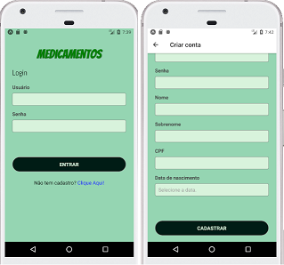
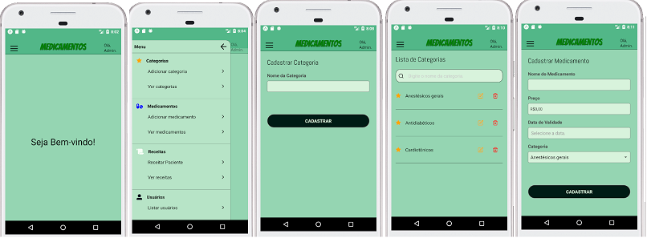
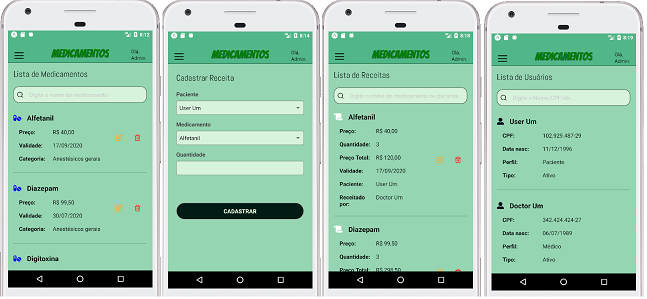
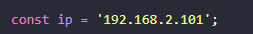
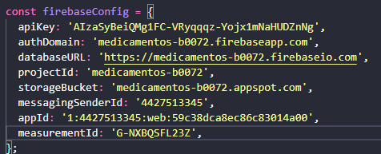
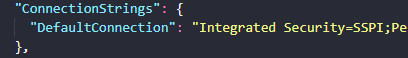

# Medicamentos App (Mobile)

#### Aplicativo com o objetivo de Médicos atribuirem remédios para pacientes.

A aplicação foi desenvolvida utilizando:

- .NET como backend, utilizando o padrão MVC.
- React-Native, utilizando Expo.
- Serviço de Autenticação do Firebase.
- SQL Server como Banco de Dados.
- Visual Code como Editor de Texto.

# Cadastro

Ao entrar no app, uma tela de autenticação é exibida e, caso o usuário não tenha cadastro, ele pode efetuar clicando no link.
Para criar uma conta é só preencher os valores com algumas validações simples:

- login tem que ser um email.
- senha tem que ser acima de 5 caracteres.
- cpf tem que ter 11 caracteres.

Para criar uma conta de médico, é só colocar qualquer valor no Númedo do CRM.  
Para criar uma conta de administrador, é só colocar qualquer valor no Número de Registro e qualquer valor com 30 caracteres no Token.

# Aplicação

- Administradores: podem criar medicamentos; categorias e atribuir receitas para os Pacientes Ativos. Podem também ver a lista de usuários.

- Médicos podem criar medicamentos, categorias e receitas, porém não pode editar nem remover elas. Os médicos não podem ver as receitas criadas por outros médicos, somente as suas.

- Paciente(usuário normal): só pode ver as receitas que lhe foram atribuidas.

- Pacientes não ativo: não são visíveis para médicos na lista de pacientes.

# Configurações

Para conectar a aplicação ao backend, deve-se:

### Pasta: `./Medicamentos/src/services/remediosApi.js`

Alterar o ip para onde a API estiver rodando.  

### Pasta: `./Medicamentos/src/services/firebaseAuth.js`

Colocar as configurações do seu Projeto Firebase.  

### Pasta: `./MedicamentosApi/appsettings.json`

Colocar a Connection String do seu SQL Server  

